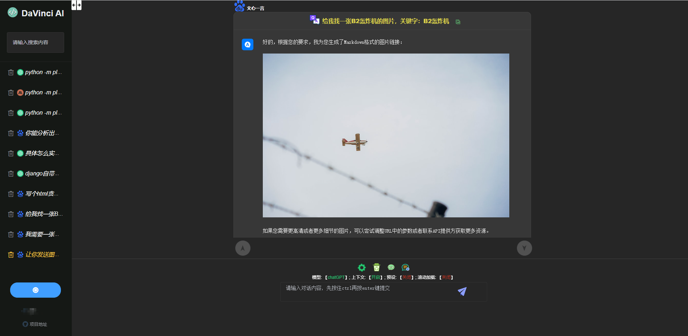
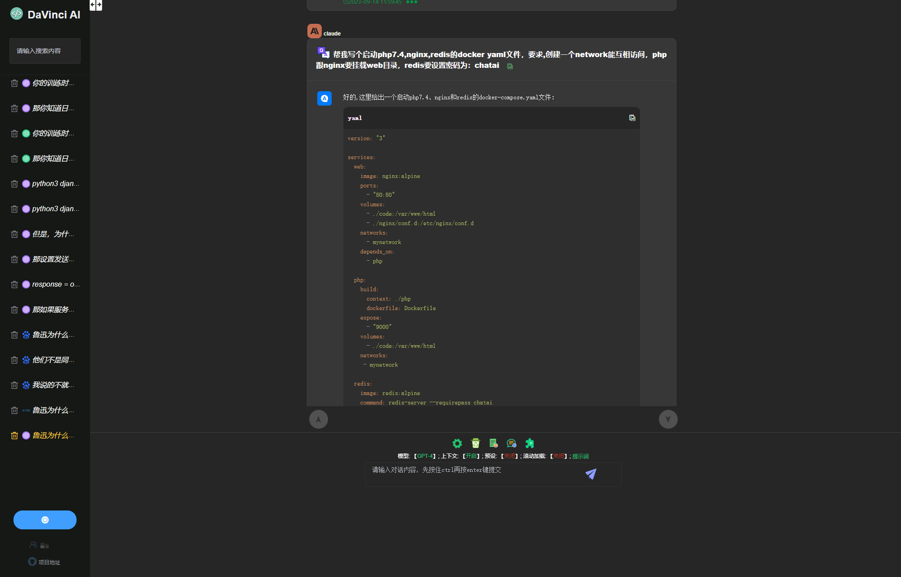
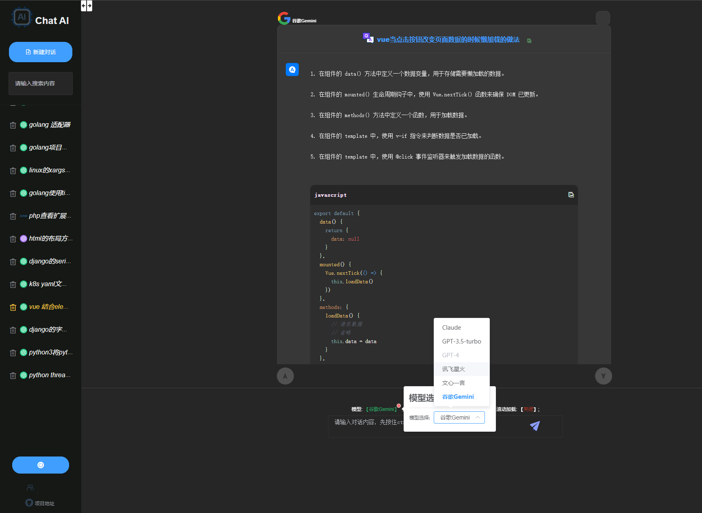

# chatAI
这是一个聚合了国内外主流AI大模型网站, 可无缝访问如：gpt-4, chatgpt, claude, 文心一言, 讯飞星火等. 更多AI大模型持续添加中....

## 安装
```
npm install
```

### 运行
```
npm run serve
```

### 编译部署
```
npm run build
```

### node版本
v16.4.0  

### npm版本
7.18.1

### 主要功能
1.无需翻墙;  
2.持续的, 可选定的, 上下文对话, 对话永久保存, 删除, 恢复;  
3.代码高亮, 丝滑响应;  
4.图片生成，文件内容分析, pdf, word文档互转;  
5.多平台ai切换:  
&emsp;&emsp;claude(已完成);  
&emsp;&emsp;gpt-4(已完成);  
&emsp;&emsp;gpt3.5-turbo(已完成);  
&emsp;&emsp;讯飞星火(已完成);  
&emsp;&emsp;文心一言(已完成);  

### web部分ui展示
  
  
  

