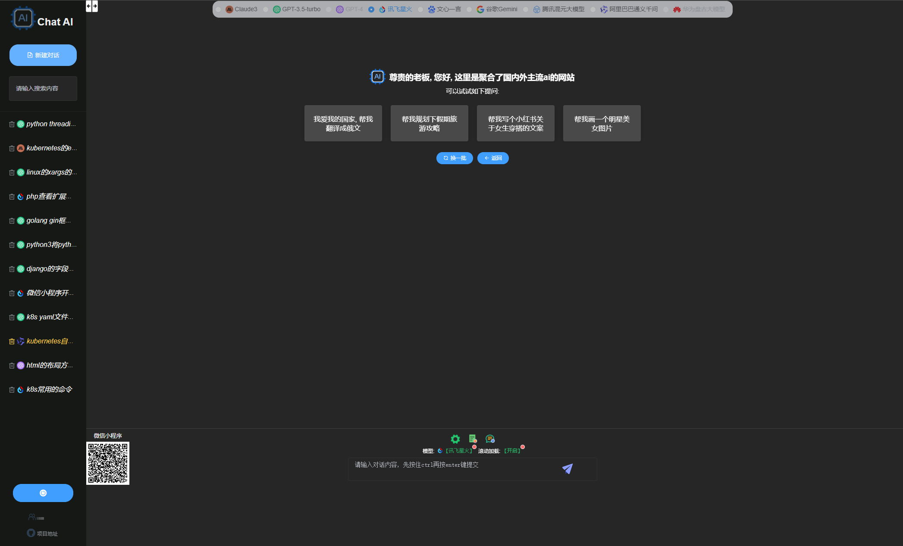
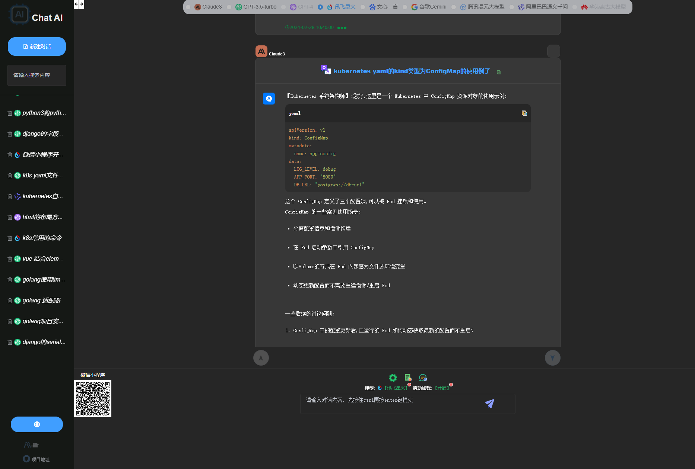

# chatAI
这是一个聚合了国内外主流AI大模型网站, 可无缝访问如：Google Gemini, chatgpt, claude, 文心一言, 讯飞星火..., 更多AI大模型持续添加中(如您有想要用的ai模型需要集成到当前网站使用请联系我,pythongolangvue@gmail.com)

## 安装
```
npm install
```

## 运行
```
npm run serve
```

## 编译部署
```
npm run build
```

### node版本
v16.4.0  

### npm版本
7.18.1

### 主要功能
1.无需翻墙, 多平台ai切换:;  
2.多用户访问, 数据隔离, 相同用户可同时登录使用;  
3.超长上下文对话, 对话保存, 删除, 恢复;  
4.代码高亮, 丝滑响应;  
5.图片生成，图片分析，文件内容分析;  

### 模型
&emsp;&emsp;Anthropic-claude3(当前全世界最牛模型, 已完成);  
&emsp;&emsp;Google-Gemini(已完成);  
&emsp;&emsp;OpenAi-gpt3.5-turbo(已完成);  
&emsp;&emsp;科大讯飞-讯飞星火(已完成);  
&emsp;&emsp;百度-文心一言(已完成);  
&emsp;&emsp;阿里巴巴-通义千问(已完成);  
&emsp;&emsp;腾迅-混元大模型(已完成);  
&emsp;&emsp;华为-盘古大模型(TODO);  
&emsp;&emsp;OpenAi-GPT-4(TODO);  

### wx小程序体验码
   


### web端体验地址  
<a href="https://tc.anythingai.online" target="_blank">体验地址</a>  
需要体验联系我：pythongolangvue@gmail.com  


### web部分ui展示
   
   

